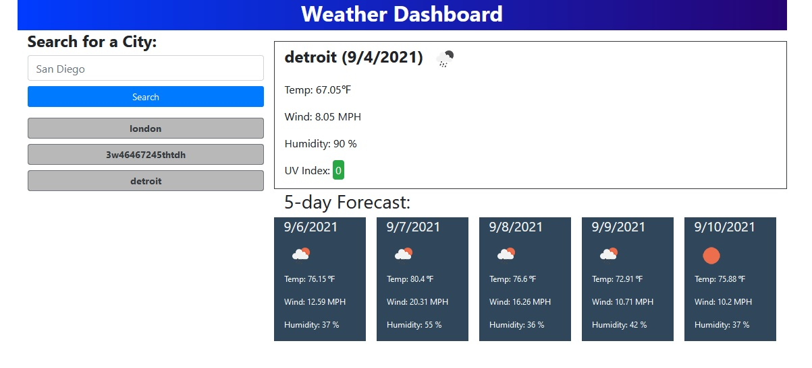

# Weather Dashboard
A useful app to that will display the current weather as well as a 5 day weather forecast for the city of your choice.
  

A link to the Weather Dashboard can be found [here](https://jondagamkd.github.io/weather/).

This site was built using [The Visual Studio Code Editor](https://code.visualstudio.com/) and [GitHub Pages](https://pages.github.com/).

This site includes bootstrap, jquery and uses the open weather one call api.
https://openweathermap.org/api/one-call-api

All projects within are the property of John T. Woodland.

